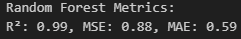
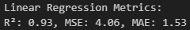
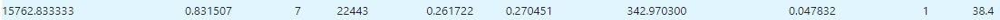
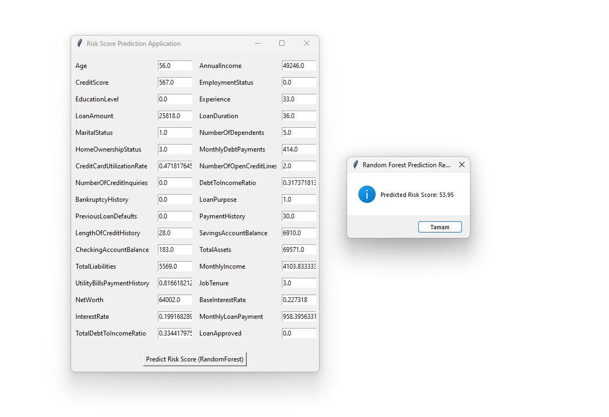

# Credit Risk Score Calculation with Regression Model

  
  
  
  

  
  

## About the Project

This project aims to develop a regression model to calculate credit risk scores for bank customers by analyzing their financial data. The model uses data such as salary, credit limits, and account balances to make predictions, optimizing the credit evaluation processes of banks.

---

## Goals 📋

1. **Accurate Credit Risk Score Calculation**: Predict risk scores using customers' financial data.
2. **Optimization**: Improve the credit evaluation processes of banks.
3. **Machine Learning Models**: Use regression models such as **RandomForest** and **LinearRegression**.

---

## Workflow

### 1. **Data Preprocessing**
- Using the `Loan.csv` dataset from Kaggle:
  - Reading data
  - Extracting statistics
  - Detecting null values
  - Determining data types
  - Identifying unique values
  - Dropping unnecessary columns
  - Applying `LabelEncoder` to object values
  - Splitting target variable

### 2. **Model Training**
- Train models with **RandomForestRegressor** and **LinearRegression**.
- Evaluate the models using metrics like **R² score** and **Mean Squared Error (MSE)**.

### 3. **Metric Generation**
- After working with both models, the RandomForestRegressor model was chosen. Below are the visualizations for the metrics.
### RandomForest:

### Linear:

### 4. **Interface Development and Result**
- Create an interface using **Tkinter** where customers can input their data and view the prediction results.
- Perform prediction tests with the model.
- The values used in these tests are held separate from the training dataset.

### First Test:

### Second Test:

## Dataset 📂

The dataset is available on Kaggle:  

  

The `Loan.csv` file is located in the `dataset/` folder.

---

## Technologies Used 🛠️
- **Python** - Main programming language
- **Pandas** - Data manipulation
- **Scikit-Learn** - Machine learning
- **Matplotlib** - Visualization
- **Tkinter** - Interface development

---

## Developers 👨‍💻

- **Furkan Hamza BOLAT**  
  **Email:** [furkanhamzabolat@gmail.com](mailto:furkanhamzabolat@gmail.com)  

- **Furkan DAYI**  
  **Email:** [furkan.dyi@hotmail.com](mailto:furkan.dyi@hotmail.com)
