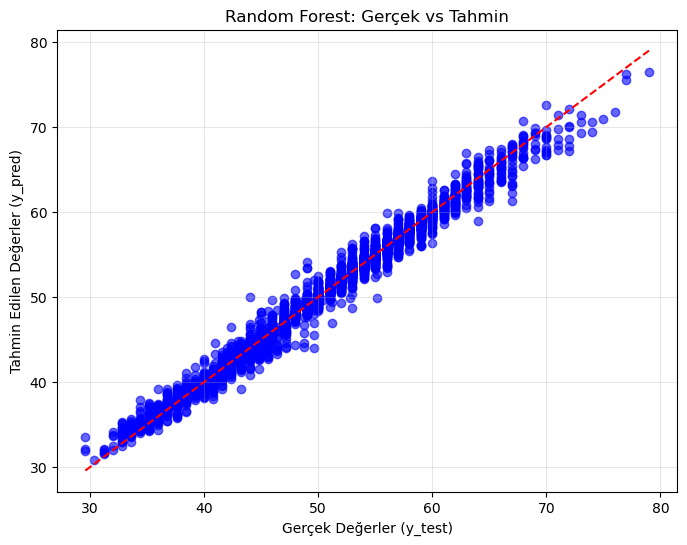
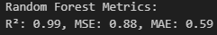
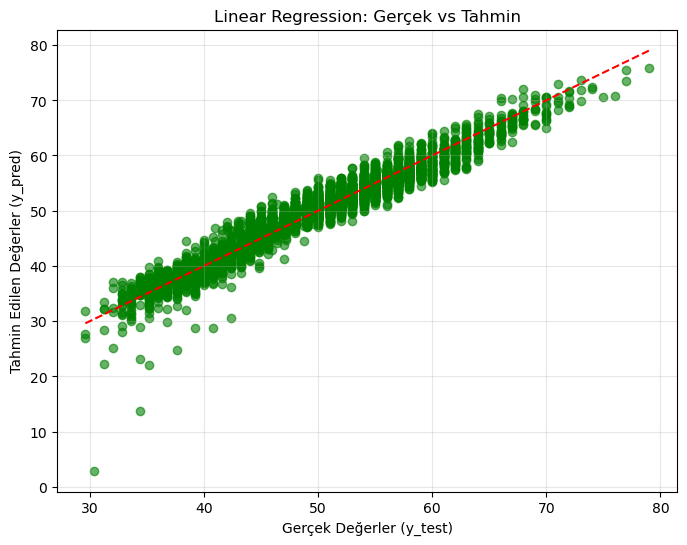
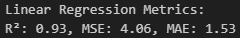
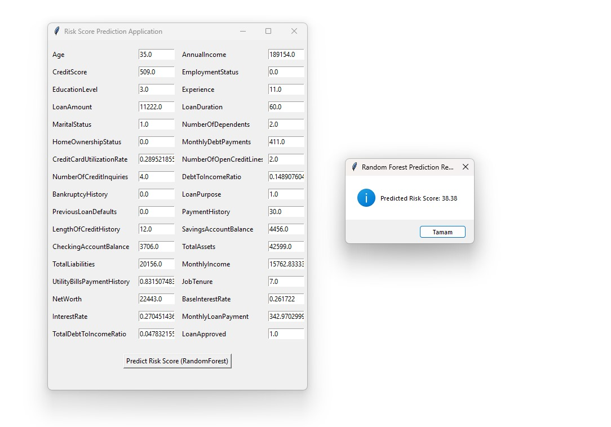
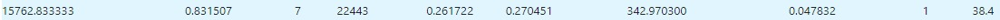
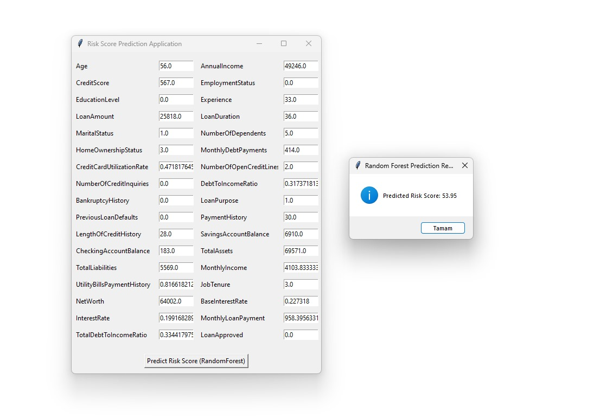
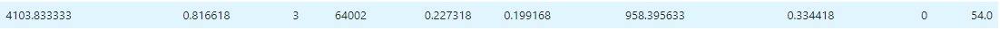

# Regresyon Modeli ile Kredi Risk Puanı Hesaplama

  
  
  
  

  
  

## Proje Hakkında

Bu proje, banka müşterilerinin finansal verilerini analiz ederek kredi risk puanlarını hesaplamak için bir regresyon modeli geliştirmeyi amaçlamaktadır. Müşterilerin maaşı, kredi limitleri ve hesaplarındaki bakiye gibi verileri kullanarak tahminler yapılır ve bankaların kredi değerlendirme süreçleri optimize edilir.

---

## Hedefler 📋

1. **Doğru Kredi Risk Puanı Hesaplama**: Müşterilerin finansal verilerini kullanarak risk puanlarını tahmin etmek.
2. **Optimizasyon**: Bankaların kredi değerlendirme süreçlerini iyileştirmek.
3. **Makine Öğrenimi Modelleri**: **RandomForest** ve **LinearRegression** gibi regresyon modellerini kullanmak.

---

## Çalışma Süreci

### 1. **Veri Ön İşleme**
- Kaggle'dan alınan `Loan.csv` veri setini kullanarak:
  - Veri okuma
  - Veri istatistiklerinin çıkarılması
  - Null değerlerin tespiti
  - Veri türlerinin belirlenmesi
  - Eşsiz değer tespiti
  - Gereksiz kolonların silinmesi
  - Object değerlere `LabelEncoder` uygulanması
  - Hedef değişkenin ayrılması

### 2. **Model Eğitimi**
- **RandomForestRegressor** ve **LinearRegression** ile modeli eğitme.
- **R² skoru** ve **Ortalama Kare Hatası (MSE)** gibi metriklerle model değerlendirme.

### 3. **Metriklerin Oluşturulması**
- İki nodel üzerindeki çalışmalar sonucu RandomForestRegressor modeli tercih edilmiştir. İlgili metriklerin görselleri aşağıdadır.
### RandomForest:

### Linear:

### 4. **Arayüz Geliştirme ve Sonuç**
- **Tkinter** kullanarak müşteri verilerini girebileceğiniz ve tahmin sonuçlarını görebileceğiniz bir arayüz oluşturma.
- Model ile tahmin testleri yapılması
- Yapılan testlerde kullanılan değerler train datasetinden ayrı tutulan değerlerdir.
### Birinci test:

### İkinci test:

## Veri Seti 📂

Veri seti Kaggle'da mevcuttur:  

  

`Loan.csv` dosyası `dataset/` klasöründe mevcut.

---

## Kullanılan Teknolojiler 🛠️
- **Python** - Ana programlama dili
- **Pandas** - Veri manipülasyonu
- **Scikit-Learn** - Makine öğrenimi
- **Matplotlib** - Görselleştirme
- **Tkinter** - Arayüz geliştirme

---

## Geliştiriciler 👨‍💻

- **Furkan Hamza BOLAT**  
  **Email:** [furkanhamzabolat@gmail.com](mailto:furkanhamzabolat@gmail.com)  

- **Furkan DAYI**  
  **Email:** [furkan.dyi@hotmail.com](mailto:furkan.dyi@hotmail.com)

